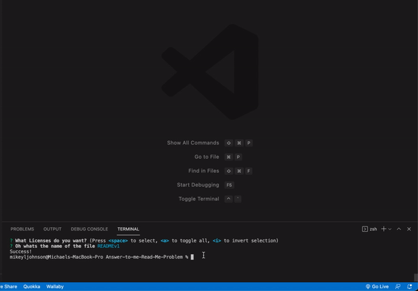
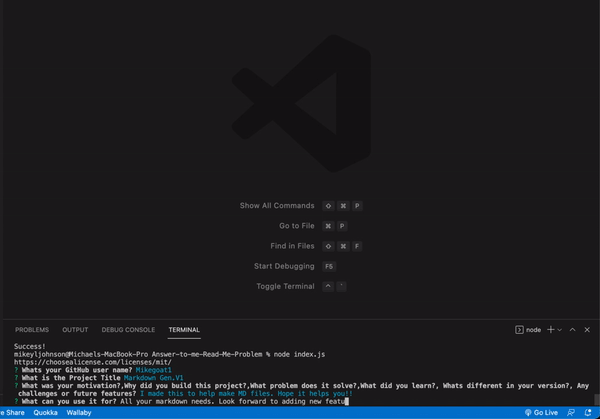
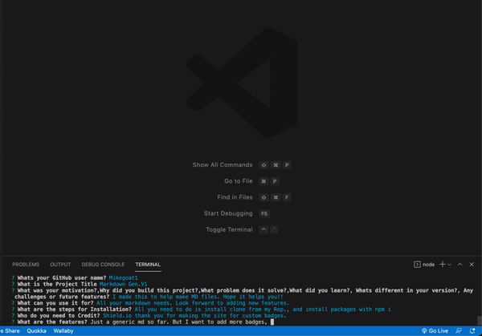

# Auto Markdown Generator 

## Description

  I created this app in order to fix a huge problem I usually have. Thats making README's for my projects. I have never been good at this portion of my projects, so I created a little aid. I hope to make this project in the future include a bit more parameters.

## Table of Contents

- [Installation](#installation)
- [Usage](#usage)
- [Credits](#credits)
- [Features](#features)
- [Liscense](#liscense)

## Installation

 Clone the file from my GitHub and do an npm install for the missing packages. We use inquirer for the question generating.

## Usage

 You can use this to make a general Markdown for your project.

## Credits

-Credit goes out to (shields.io). Support @ <https://opencollective.com/shields>.

## Features

## Liscense

This product is license with MIT
<https://choosealicense.com/licenses/mit/>
